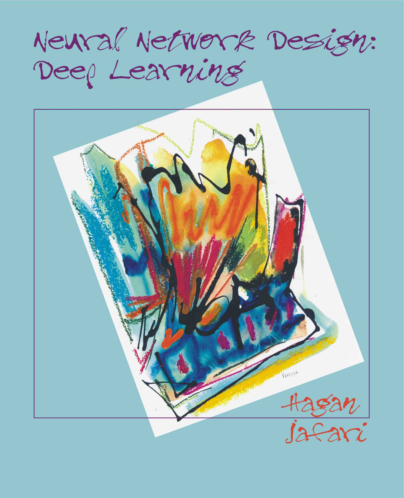

# Neural Network Design: Deep Learning

This is an introductory textbook on **Deep Learning**,
authored by Martin Hagan and Amir Jafari. 
This site contains a folder for each chapter of the book. 
Each folder has a Docs subfolder containing PDF files of 
the chapter and associated slides. 
For chapters covering code, there is a Code subfolder containing 
a Jupyter Notebook of the chapter, as well as Jupyter Notebook labs.

**Be aware that this site will be continually evolving. 
New chapters will be added, and existing chapters will 
undergo revisions.**

## Python Demos
There are interactive Python demonstrations that are integrated 
into most chapters of the book, in order to illustrate important 
concepts. These can be installed using pip. See the associated 
[website](https://pypi.org/project/nndesigndemos/).

## First Volume
This book is a second volume in the Neural Network Design 
series. Information on the first book is contained [here](https://hagan.okstate.edu/nnd.html).
